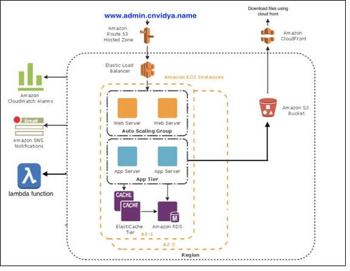
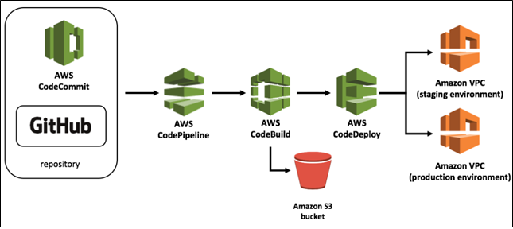
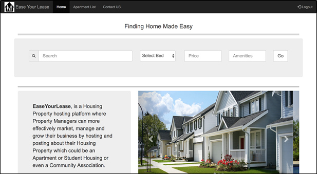
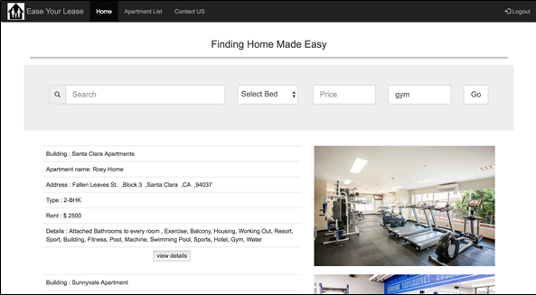

"# LeasingApp" 

## About App:
The app has been deployed as a Docker Container on AWS ECS, provides a mechanism to search for Apartments, integrated with voice search using Amazon Alexa, allowing users to search for apartments by giving voice commands. For secure authentication Okta login has been implemented along with other services such as Jenkins, Tableau, GitHub, Facebook and Twitter share to engage customers. 

### Key AWS Services used
        • Elastic Container service
        • AWS CodeCommit
        • AWS CodePipeline 
        • AWS CodeDeploy
        • AWS Lambda
        • AWS Redis
        • AWS ElasticSearch
        • AWS Quicksight
        
            
## Architecture

## CICD Architecture

## Apartment Search Page

## Apartment Listing Page   

